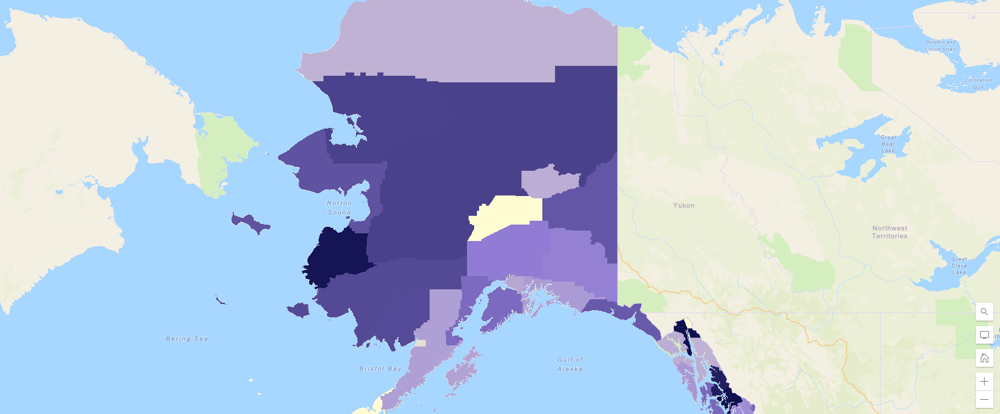

# Overview

With the "data-boom" every branch of data brings a different attribute and helping people understand trends in data and having a better understanding if location involves certain information where the visualization and spacial analysis can bring insight to the questions that we may have.

This repository goes through my experience with ArcGIS. ArcGIS is a tool that in here you will be able to see an applied problem that I have been able to solve with ArcGIS.

One of the places that they use a lot of Geographical data is in the government when they do the census, the map that I created helps you see the change in population over different years, once you hover over the mark it should show it to you.

# Development Environment

I used the library extension for Python to use ArcGIS, which at the same time you have to download an engine that ArcgIS needs which is called Anaconda.

In this code, we utilized ArcGIS for Python to create a map displaying the counties in Alaska. We first loaded a dataset containing information about various counties, including their names, population, and year of data collection. Using the ArcGIS API, we connected to an ArcGIS Online account. We then processed the dataset, converting each row into a feature with attributes like county name, population, and year. These features were represented as Point geometries on the map. We published the feature collection as a hosted feature layer in ArcGIS. Finally, we visualized the feature layer on a map, allowing us to view and interact with the neighborhood data.

# Useful Websites

{Make a list of websites that you found helpful in this project}
* [ArcGIS API for python](https://developers.arcgis.com/python/)
* [Developing with ArcGIS](https://developers.arcgis.com/documentation/mapping-apis-and-services/visualization/)

# Future Work

Since ArcGIS is a very rich and complex tool there are few things I would like to keep showing how it work.
* Layers
* Different types of map
* Connect them to a third API like weather.